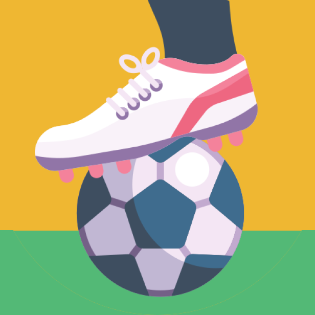
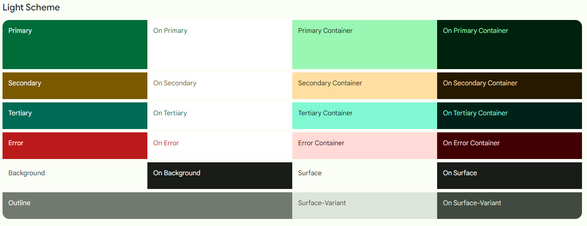
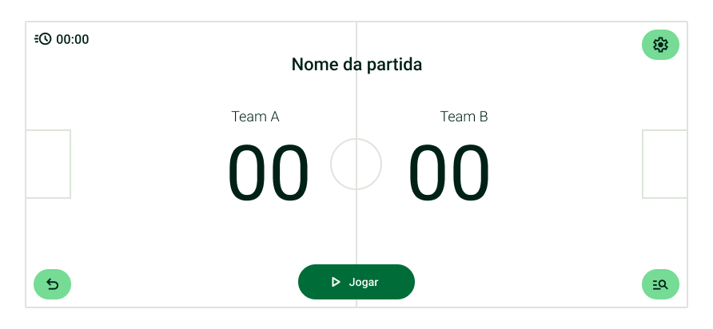
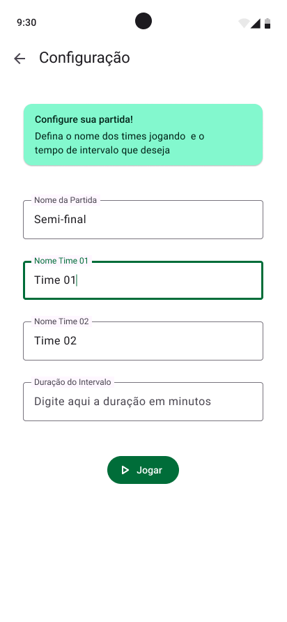
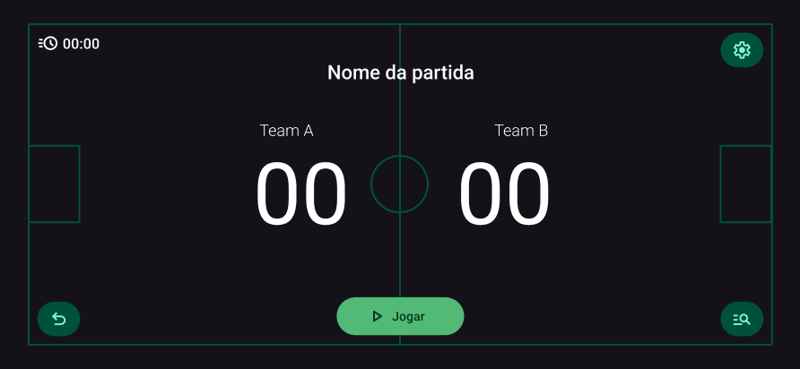
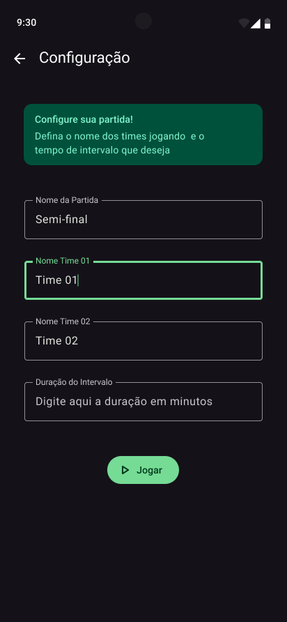
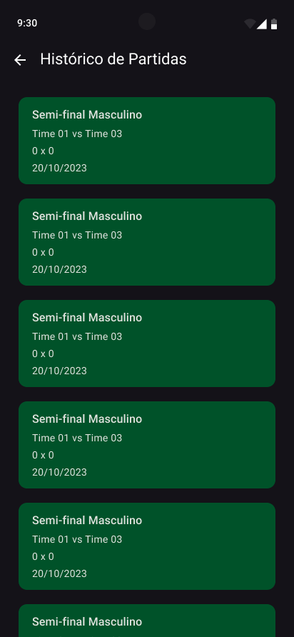

# FutScore :soccer:

> **Equipe:** 
>   
>   * Gabriel Vasconcelos da Silva (511451)
>   * Gabriel Vieira Marques (509640)
>   * João Victor Barroso Alves (509697)
>   * Yanna Torres Gonçalves (507773)
>
> **Disciplina:** Programação para Dispositivos Móveis (SMD0122)
>
> **Professor:** Dr. Windson Viana

**Sumário: [A Atividade](#a-atividade-page_with_curl) • [Ícone, Paleta de Cores e Novo Layout](#ícone-temas-e-layouts-paintbrush) • [Configurações](#configurações-gear) • [Funcionalidades do Placar](#funcionalidades-do-placar-goal_net) • [Histórico](#histórico-scroll) • [Resultados](#resultados-play_or_pause_button) •**

## A atividade :page_with_curl:

Você deve criar um aplicativo que permita o usuário configurar o placar de um esporte, por exemplo, indicando o número de sets, tempos, a duração do jogo, condições para finalizar. Também deve permitir adicionar o nome dos jogadores ou equipes e do torneio. O placar deve ter uma interface simples na qual a alteração dos valores deve ser feita a partir de toques na tela, sem a necessidade de inserção de valores. A interface deve ter também algum evento para retornar ao placar anterior caso o usuário toque sem querer na tela.

O aplicativo deve salvar a configuração padrão (a última configuração) do placar e também o resultado final dos últimos 5 jogos.

Pontuação: 
1. **(4 pontos)** - Interface do Placar
2. **(3 pontos)** - Armazenamento Local (histórico e configuração) 
3. **(1 ponto)** - Lidar/Exibir o tempo e interrupções 
4. **(1 ponto)** - Ctrl+z
5. **(1 ponto)** - Corretude Geral

## Ícone, Temas e Layouts :paintbrush:

### Ícone

O ícone foi retirado do site [Flaticon](https://www.flaticon.com/free-icon/football-ball_3379077?term=soccer+game&page=1&position=16&origin=tag&related_id=3379077), que fornece ícones e imagens de forma gratuita.

|   Ícone   |
|-----------|
|  |


### Temas e Layouts

O design deste app foi feito seguindo as guidelines da terceira versão do [Material Design](https://m3.material.io/), utilizando o toolkit de design disponível no Figma e o [Material Theme Builder](https://m3.material.io/theme-builder).

#### Temas

|     |
|-|
|     |

#### Layouts

Assim, definimos as seguintes telas:

|   Tela de Placar  |   Tela de Configuração    |   Tela de Histórico   |
|-----------|----------| ---------|
|   |     |   |
|   |   |   |

## Configurações :gear:

Esse placar segue as regras definidas pela Confederação Brasileira de Futebol (CBF) e o [Livro de Regras 2023/2024](https://www.cbf.com.br/a-cbf/arbitragem/aplicacao-regra-diretrizes-fifa/livro-de-regras-2023-2024-portugues-brasileiro).

Assim, a única configuração que já vem "fixa de fábrica" é a duração do jogo: que é definido por dois tempos iguais de **45 minutos**, ou seja, tempo total de 90 minutos.

As configurações que poderão ser modificadas a cada jogo são:

*   Nome da Partida;
*   Nome dos Times;
*   Duração do Intervalo (que, segundo a CBF, não deve exceder 15 minutos).

// TODO: colocar explicação do código

## Funcionalidades do Placar :goal_net:

1. Estados

   Todos os estados, como nome do jogo, times e escores são inicializados pelos dados passados pela tela de configuração, mas por padrão eles vêm vazios ou zerados.
   
   ```kotlin
     val game = intent.getStringExtra("game")
        val teamOne = intent.getStringExtra("teamOne")
        val teamTwo = intent.getStringExtra("teamTwo")
        val interval = intent.getIntExtra("interval", 0)

        btnStart = findViewById(R.id.btnStart)
        txtGame = findViewById(R.id.txtGame)
        txtTeam01 = findViewById(R.id.txtTeam01)
        txtTeam02 = findViewById(R.id.txtTeam02)
        txtScore01 = findViewById(R.id.txtScore01)
        txtScore02 = findViewById(R.id.txtScore02)
        txtTimer = findViewById(R.id.txtTimer)
        btnSettings = findViewById(R.id.btnSettings)
        btnHistory = findViewById(R.id.btnHistory)
        btnUndo = findViewById(R.id.btnUndo)

        txtGame.text = game
        txtTeam01.text = teamOne
        txtTeam02.text = teamTwo
   ```

   Foi criado uma classe para administrar o score de forma a implementar duas pilhas para os escores individuais e métodos que auxiliam a impilhar novos valores ou desempilhar:
   
   ```kotlin
      class ScoreManager {
        private val stackScore01 = Stack<Int>()
        private val stackScore02 = Stack<Int>()
    
        init {
            stackScore01.push(0)
            stackScore02.push(0)
        }
    
        fun updateScore(team: Int, newScore: Int) {
            if (team == 1) {
                stackScore01.push(newScore)
            } else if (team == 2) {
                stackScore02.push(newScore)
            }
        }
    
        fun undo(team: Int) {
            if (team == 1 && stackScore01.size > 1) {
                stackScore01.pop()
            } else if (team == 2 && stackScore02.size > 1) {
                stackScore02.pop()
            }
        }
    
        fun getScore(team: Int): Int {
            return if (team == 1) {
                stackScore01.peek()
            } else {
                stackScore02.peek()
            }
        }
    }
   ```

   Foi criada uma classe para administrar o timer do jogo:

   ```kotlin
    class CountUpTimer(private val onTickCallback: (Long) -> Unit) {
        private val handler = Handler()
        private var elapsedTime = 0L
        private var isRunning = false
    
        fun start() {
            isRunning = true
            handler.postDelayed(object : Runnable {
                override fun run() {
                    if (isRunning) {
                        elapsedTime++
                        onTickCallback.invoke(elapsedTime)
                        handler.postDelayed(this, 1000)
                    }
                }
            }, 1000)
        }
    
        fun stop() {
            isRunning = false
        }
    }
   ```

   Uma varável booleana foi criada para identificar se o jogo havia começado ou não, e o score e o timer forma instanciados em objetos na atividade principal:
   
   ```kotlin
    var gameStarted: Boolean = false
    private var countUpTimer: CountUpTimer? = null
    var score = ScoreManager()
    var scoreTeam01: Int = score.getScore(1)
    var scoreTeam02: Int = score.getScore(2)
   ```
   
2. Jogar

   Para jogar, basicamente é verificado se os valores dos estados estão preenchidos, chegando um deles, se estiver, o timer começa a contar até um certo valor (x + intervalo), durante o jogo, ele fica atualizando o timer, quando está no intervalo ele mostra o intervalo, e quando o jogo termina ele reseta todos os estados e informa o fim do jogo:

   ```kotlin
   btnStart.setOnClickListener(View.OnClickListener {
      if(txtGame.text != ""){
          gameStarted = true
          btnStart.isClickable = false
          countUpTimer = CountUpTimer { elapsedTime ->
              if (elapsedTime >= 60 + (interval*60)) {
                  saveGame();
                  countUpTimer?.stop()
                  txtTimer.text = "Tempo esgotado"
                  gameStarted = false
                  btnStart.isClickable = true
                  txtGame.text = ""
                  txtTeam01.text = ""
                  txtTeam02.text = ""
                  score.updateScore(1,0)
                  score.updateScore(2,0)
                  scoreTeam02 = 0
                  scoreTeam02 = 0
                  txtScore01.text = "00"
                  txtScore02.text = "00"

              } else {
                  if(elapsedTime >= 30 && elapsedTime < 30 + (interval*60)){
                      txtTimer.text = "Intervalo..."
                  }else {
                      txtTimer.text = formatTime(elapsedTime)
                  }
              }
          }
          countUpTimer?.start()
      }
    })
   ```
3. Interações do jogo

   As interaçõe possíveis no jogo são basicamente marcar os gols nos respectivos scores dos times, através do clique no score do time. Quando isso é feito, a pilha com os scores é atualizada:

   ```kotlin

       txtScore01.setOnClickListener(View.OnClickListener {
                  if(gameStarted && (txtTimer.text != "Intervalo...")){
                      score.updateScore(1, scoreTeam01 + 1)
                      scoreTeam01 = score.getScore(1)
                      updateScore()

                score.updateScore(2, scoreTeam02)
                scoreTeam02 = score.getScore(2)
                updateScore()
            }
        })

        txtScore02.setOnClickListener(View.OnClickListener {
            if(gameStarted && (txtTimer.text != "Intervalo...")){
                score.updateScore(1, scoreTeam01)
                scoreTeam01 = score.getScore(1)
                updateScore()

                score.updateScore(2, scoreTeam02 + 1)
                scoreTeam02 = score.getScore(2)
                updateScore()
            }
        })
   ```

   Outra possível interação é voltar o score anterior com o botão de desfazer, ele basicamente chama a função de desempilhar para as dois scores:

   ```kotlin
       btnUndo.setOnClickListener(View.OnClickListener {
                if((txtTimer.text != "Intervalo...")){
                    score.undo(1)
                    scoreTeam01 = score.getScore(1)
                    updateScore()

                score.undo(2)
                scoreTeam02 = score.getScore(2)
                updateScore()
            }
        })
   ```

4. Navegação

   Na página inicial também possuem dois botões para navegar para as telas de configuração e para a tela de histórico:

   ```kotlin
    btnSettings.setOnClickListener {
                if(!gameStarted) {
                    val intent = Intent(this, ConfigActivity::class.java)
                    startActivity(intent)
                }
            }
    
    btnHistory.setOnClickListener {
        if(!gameStarted) {
            val intent = Intent(this, HistoricActivity::class.java)
            startActivity(intent)
        }
    }
   ``` 

## Histórico :scroll:

// TODO: colocar explicação do código

## Resultados :play_or_pause_button:

Aqui estão os resultados finais do placar:

// TODO: colocar vídeos

[Voltar ao início &uarr;](#futscore-soccer)
