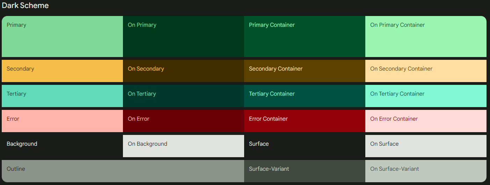
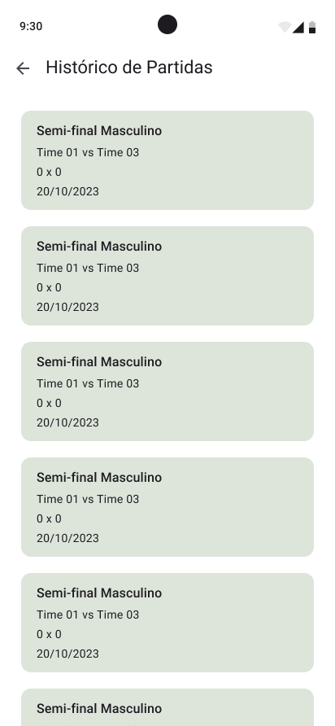

# FutScore :soccer:

> **Equipe:** 
>   
>   * Gabriel Vasconcelos da Silva (511451)
>   * Gabriel Vieira Marques (509640)
>   * João Victor Barroso Alves (509697)
>   * Yanna Torres Gonçalves (507773)
>
> **Disciplina:** Programação para Dispositivos Móveis (SMD0122)
>
> **Professor:** Dr. Windson Viana

**Sumário: [A Atividade](#a-atividade-page_with_curl) • [Ícone, Paleta de Cores e Novo Layout](#ícone-temas-e-layouts-paintbrush) • [Configurações](#configurações-gear) • [Funcionalidades do Placar](#funcionalidades-do-placar-goal_net) • [Histórico](#histórico-scroll) • [Resultados](#resultados-play_or_pause_button) •**

## A atividade :page_with_curl:

Você deve criar um aplicativo que permita o usuário configurar o placar de um esporte, por exemplo, indicando o número de sets, tempos, a duração do jogo, condições para finalizar. Também deve permitir adicionar o nome dos jogadores ou equipes e do torneio. O placar deve ter uma interface simples na qual a alteração dos valores deve ser feita a partir de toques na tela, sem a necessidade de inserção de valores. A interface deve ter também algum evento para retornar ao placar anterior caso o usuário toque sem querer na tela.

O aplicativo deve salvar a configuração padrão (a última configuração) do placar e também o resultado final dos últimos 5 jogos.

Pontuação: 
1. **(4 pontos)** - Interface do Placar
2. **(3 pontos)** - Armazenamento Local (histórico e configuração) 
3. **(1 ponto)** - Lidar/Exibir o tempo e interrupções 
4. **(1 ponto)** - Ctrl+z
5. **(1 ponto)** - Corretude Geral

## Ícone, Temas e Layouts :paintbrush:

### Ícone

O ícone foi retirado do site [Flaticon](https://www.flaticon.com/free-icon/football-ball_3379077?term=soccer+game&page=1&position=16&origin=tag&related_id=3379077), que fornece ícones e imagens de forma gratuita.

|   Ícone   |
|-----------|
|  |

### Temas e Layouts

O design deste app foi feito seguindo as guidelines da terceira versão do [Material Design](https://m3.material.io/), utilizando o toolkit de design disponível no Figma e o [Material Theme Builder](https://m3.material.io/theme-builder).

#### Temas

|     |
|-|
|     |

#### Layouts

Assim, definimos as seguintes telas:

|   Tela de Placar  |   Tela de Configuração    |   Tela de Histórico   |
|-----------|----------| ---------|
|   |     |   |
|   |   |   |

## Configurações :gear:

Esse placar segue as regras definidas pela Confederação Brasileira de Futebol (CBF) e o [Livro de Regras 2023/2024](https://www.cbf.com.br/a-cbf/arbitragem/aplicacao-regra-diretrizes-fifa/livro-de-regras-2023-2024-portugues-brasileiro).

Assim, a única configuração que já vem "fixa de fábrica" é a duração do jogo: que é definido por dois tempos iguais de **45 minutos**, ou seja, tempo total de 90 minutos.

As configurações que poderão ser modificadas a cada jogo são:

*   Nome da Partida;
*   Nome dos Times;
*   Duração do Intervalo (que, segundo a CBF, não deve exceder 15 minutos).

// TODO: colocar explicação do código

## Funcionalidades do Placar :goal_net:

// TODO: colocar explicação do código

## Histórico :scroll:

// TODO: colocar explicação do código

## Resultados :play_or_pause_button:

Aqui estão os resultados finais do placar:

// TODO: colocar vídeos

[Voltar ao início &uarr;](#futscore-soccer)
